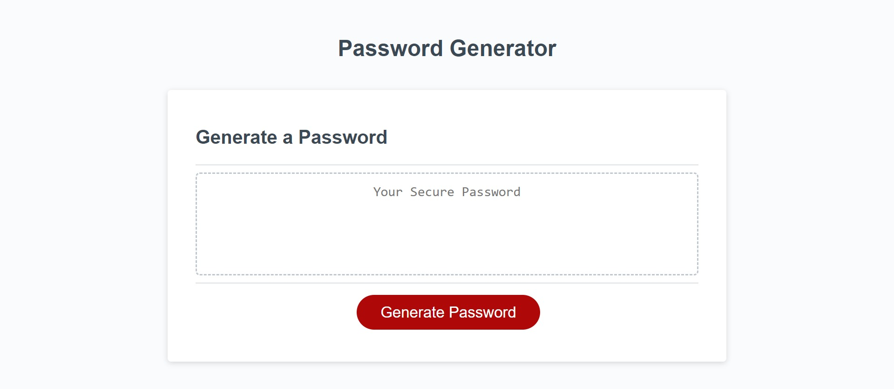

# Password Generator

This is the third project from the University of Adelaide's coding boot camp. The webpage is a portfolio webpage demonstrating my newly gained JavaScript coding ability. 

## Table of Contents

- [Features](#features)
- [Link-to-Webpage](#Link-to-Webpage)
- [Appearance](#Appearance)
- [About-Developer](#About-developer)
- 

## About-developer

Hi my name is Molaligne (Mola) Dafa. I am currently participating in a coding boot camp and this is my Second project. 
In it, I have attempted to demonstrate my skills in CSS and HTML.

## Features

- Customisable password criteria
- Button initialised password generation
- - 
  
 
  
## Link-to-Webpage
- https://mola90.github.io/Password-Generator/

## Appearance

The following image demonstrates the page's appearance

